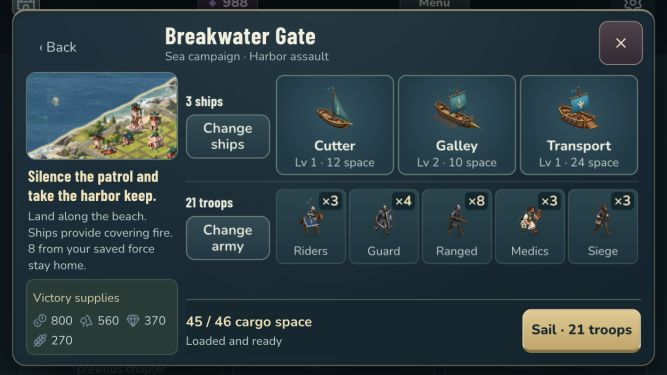
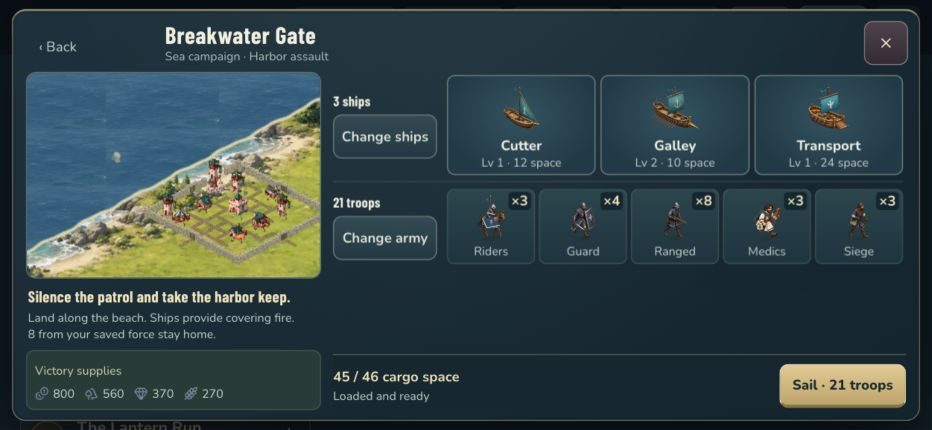
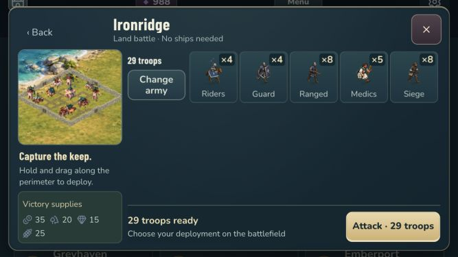

# Build 16: simpler battle preparation

20 September 2026. Internal test candidate, not a commercial release.

## What changed

- A sea mission opens on one overview with its objective, fleet, troops, capacity and Sail action. The normal overview fits at 667 × 375, 844 × 390 and 932 × 430 landscape without scrolling.
- Recommendations use only owned, ready ships and owned, unlocked troops. The loader preserves frontline and ranged units before specialists, fills transports before escorts, and respects every individual hold as well as fleet capacity.
- Change army uses large plus/minus controls. Change ships explains unavailable vessels and explicitly asks which ship to replace when the fleet is full. Ship manifests are optional within Change ships.
- Cargo can move into spare room or make an explicitly confirmed equal-size exchange between full ships. Exchanges conserve the selected army and respect hold limits.
- Launch uses the force currently shown, including the latest edit. Land preparation has no naval controls. Supplied practice, story and defense missions retain their own forces and levels.
- Back returns to the correct Land or Sea board, Army practice or Journal chapter/trial. Army and Harbor detours return through the same mission. Closing or replacing a mission removes stale preparation history.
- The footer, Back and Close remain visible while optional editors scroll. Preparation uses dark panels and consistent gold primary actions.

## Verification

Browser checks used a disposable copy of the established Keep 7 phone save. A changed force launched with exactly the edited counts: four cavalry, four shieldbearers, nine crossbowmen, five medics and six grenadiers. Dragging a shieldbearer from the persistent tray to the beach decremented the tray once and issued a landing. Retreat and return home completed without recorded browser errors. This battle did not run on the physical phone.

The smallest browser overview was measured with no panel overflow: a 283 px scene, 220 px content region and visible pinned footer. Larger landscape sizes were also visually checked. Fleet replacement cancellation, unavailable ship explanations and a confirmed cargo swap were checked through the UI.

Final checks passed: the build/module/type/lint pipeline, all 83 frontend tests, three targeted backend scenarios and 31 native policy checks. Automated coverage includes current launch snapshots, land and supplied forces, capacity, ownership, recommendations, cargo conservation, unavailable ships, draft resets, navigation history and duplicate launch protection. Both native builds succeeded, and their bundled web code matches the final source bundle byte for byte.

The final Build 16 app was installed and launched in the iPhone 15 Pro Max Simulator. Sea preparation, one-click troop decrement/increment, the fixed footer, Back to the Sea board, both landscape orientations and the landscape lock were visually checked. The initial mission capture preceded the dialog repaint; a subsequent observation showed the dialog without a second click. No transition-latency guarantee is inferred from that observation.

The final browser bundle also passed the nested path Sea mission → Army → Practice → Back to Army → Back to Sea, without reopening a stale mission.

## Physical installation

Build 16 was installed on the paired physical iPhone 15 Pro Max. Installed identity was independently read back as `com.chrismozer.stonewake`, version 1.0, build 16. Before first launch, the primary save was byte-for-byte identical to the immediate pre-install backup: revision 507, 988 gems, 56 troops, 38 buildings, eight ships, five provinces and campaign progress 10 land / 2 sea. The backup and installation evidence are private under `~/Library/Developer/Stonewake-review/preparation16/`.

The first remote launch was rejected with a generic iOS signature/entitlement/developer-trust error. The signed bundle verifies locally; the signing certificate is present in the provisioning profile, both are within their validity dates, the exact device is listed and the bundle/team entitlements match. This does not prove the phone's launch trust state. After Mirroring authentication, the second remote launch was rejected because the device was locked. No security setting or developer-trust setting was changed.

The user has been asked to open Stonewake directly once to distinguish an iOS verification prompt from a successful launch. Physical Build 16 visual and finger-input acceptance are pending this result. Simulator success is not substituted for that evidence.

## Screens

## Limits and next work

This delivery addresses entering and preparing a battle. It does not complete the village art, roads, connected walls, troop upgrade art, combat effects, store value or wider menu redesign in the [reassessment](../reassessment16/STONEWAKE-REASSESSMENT.md).

Browser clicks and Simulator or Mirroring clicks do not establish physical finger-tap reliability. The repeated-tap report remains open until measured and reproduced on the phone. No new premium-currency grant, real purchase, backend deployment or post-level-10 content is part of this change.

The next visual milestone remains one cohesive capital scene with readable roads, connected walls and unmistakable Keep and unit progression, reviewed at ordinary phone scale. It should follow the interaction and art contract rather than adding more competing menu systems.
