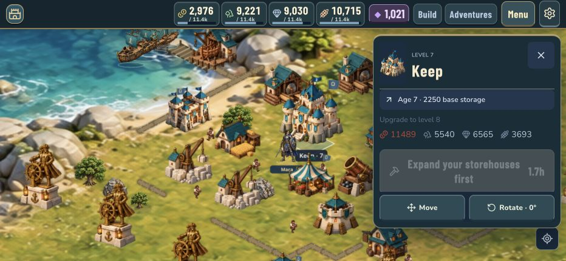
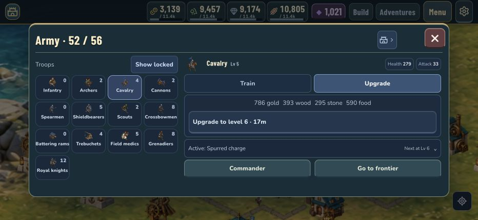
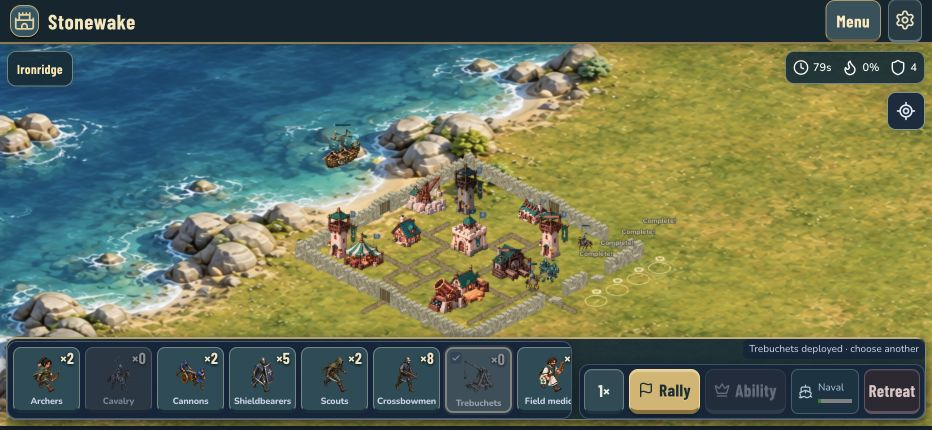

# Stonewake: a plan for a game that feels good to play

Build 13 audit and proposed rebuild · September 19, 2026

**Recommendation: make the next release a usability repair, then prove a complete, polished battle before expanding the game again.** The coastal identity and more dimensional buildings are worth keeping. Progression, navigation, input, and animation need to become one coherent experience.

This plan is based on fresh screenshots, an isolated copy of the current iPhone kingdom, actual menu and battle interactions, and the shipped game rules. It is a plan, not a claim that these changes have been implemented. The iPhone save was read only. Test battles used a separate browser copy; the simulator's original save was restored afterward.

## 1. What the audit established

### The Keep and Storehouse create an apparent dead end

The copied kingdom has Keep 7, one Storehouse 7, a highest Quarry of 6, Barracks 7, ten captured campaign towns, and two free construction crews.

| Requirement for Keep 8 | Current state | What the player needs |
| --- | --- | --- |
| Gold capacity | 11,363 maximum; upgrade costs 11,489 gold | Another Storehouse. The gap is only 126 capacity. |
| Storehouse upgrade | Storehouse 7 requires Keep 8 | Build a second Storehouse instead of upgrading the first. One of three permitted Storehouses is built. |
| Quarry | Highest is level 6 | Complete Quarry 7. |
| Barracks | Level 7 | Already met. |
| Campaign | Ten strongholds captured | Already met. |
| Resources | 121 gold at the copied save's timestamp | Earn or claim supplies after making room. Balances change with time. |

A new level 1 Storehouse costs 140 gold, 110 timber, 60 stone, and 40 food. It raises capacity to 12,163. On an isolated, fully funded copy with that Storehouse and Quarry 7, the actual upgrade rule successfully started Keep 8.

**This is a confirmed guidance and dependency problem, not a proven impossible economy.** The UI reports storage first, while the action rule checks the Quarry first. Neither gives the player the whole route. The Storage screen actively says “Upgrade for more capacity” on a Storehouse that cannot currently upgrade.

### Deployment supports only part of the requested gesture

- Dragging from the Cavalry card onto the battlefield deployed zero troops. It did not switch the selected troop.
- Selecting Cavalry, then dragging on the map, deployed the four reserves. The same map gesture deployed four Trebuchets.
- The card currently has a click handler, without a continuous drag handoff to the battlefield.
- Map input waits 260 milliseconds before repeat deployment, repeats every 140 milliseconds, and can change to panning if the finger moves out of the valid area before deployment starts.
- On release, the handler can deploy up to eight unconsumed path positions. That makes some gestures commit troops at release rather than consistently under the finger.
- At 932 × 430, the troop strip had 563 pixels of usable width for 797 pixels of cards. Secondary controls occupied about 346 pixels. The copied army produced ten troop types plus a commander in battle.

These observations support replacing the gesture handling and reducing battle loadout complexity. They do not establish iPhone touch latency; the live gesture test used a browser pointer, not a physical finger.

### Progression exists, but the player can barely see it

- Thirteen trainable troop types are unlocked by Keep 6. Many overlap: infantry, spearmen, shieldbearers; archers and crossbows; cavalry and knights.
- The army screen uses 9-pixel troop labels at the tested short landscape size. The cards technically fit, but the silhouettes and distinctions are difficult to read.
- Current troop health and base damage increase with level. Abilities already exist at levels 3, 6, and 9. The task is to make those changes understandable, visible, and satisfying, and ensure displayed stats match combat modifiers.
- The Cavalry 5 upgrade screen displays the current stats, cost, and duration. It does not show the level 6 model or the stat difference. Its upcoming charge ability is behind a disclosure control.
- The newer building artwork gives Keep, Cottage, Barracks, and Storehouse three principal silhouettes. Sixteen utility building kinds use a single principal image. Small scaling and overlays do not meet the requested visible progression.
- The newer infantry, archer, and healer art has four walking frames and four attack frames. Other troops use older artwork. Some deaths rotate and squash the standing image. Building destruction breaks the flat building image into fragments. Those implementations explain the limited motion and inconsistent style.

### The menu problem is structural

- The main menu has nine illustrated destinations and four utility destinations. Other screens add a separate switcher with another nine destinations. Build, City, Adventures, Frontier, Fleet, Storage, and Store overlap in purpose or lead across several menu systems.
- Opening the Keep's ten-level preview leaves its contents below the visible area while Move and Rotate remain pinned above them. The most useful information loses space to secondary actions.
- Adventures defaults to the final chapter mission when none is immediately claimable or available. In this kingdom it opens the locked sixth mission, although the next unfinished task is connecting a road to the harbor in mission two.
- In short landscape, story dialogue and artwork take priority over the missing requirement. The disabled “Complete the requirements” button is visible while the actionable road requirement is below the initial view.
- The Build catalog shows four complete cards and a cut-off second row at 932 × 430. The Storehouse needed to resolve the Keep issue is much farther down the All list.
- The Fleet screen initially displays only two of four ships. After a battle, the sunk ship and repair action are below the fold. The large berth summary occupies a separate column without helping the immediate task.
- The Shipyard catalog still promises “+500 storage”; the actual capacity rule counts the Keep and Storehouses. This is stale gameplay copy.
- A deployment emits the generic construction effect with a blank label. The effect replaces the blank with “Complete!”, producing inappropriate completion labels along the deployment path.

The two additional theme files contain 845 `!important` declarations in total. That count does not itself prove a defect, but the overlapping overrides are a maintenance warning. Continuing to add another skin is likely to preserve conflicting layout rules.

### Naval combat is present, but the player has almost no decisions

The current battle model accepts one attacking support ship and at most two defending ships. Ships automatically approach an opposing vessel, circle at close range, then move to a fixed coastal station for bombardment. Their movement is confined to a narrow coordinate strip. The player receives a hull/status indicator, without steering, focus fire, or a disengage order.

In the disposable Ironridge battle, the level 4 Bombard defeated the defending ship, then was sunk by shore defenses. **Enemy ships and destructible player ships already work in this scenario.** The improvement needed is a larger tactical space, readable threats, and player agency. This one mismatched encounter is not evidence that naval balance is good across levels.

## 2. The experience we should build toward

The player should be able to answer four questions immediately: **What can I improve? What will it change? What can I do now? What happened because of my decision?**

The main loop should be:

1. Arrive at a readable, living coastal village.
2. See one useful next objective and a few ready activities.
3. Improve a building or train a saved army in a few deliberate taps.
4. Scout a coastal target, choose a compact force, and understand the reward and danger.
5. Deploy continuously, make a small number of meaningful land and naval decisions, and clearly see their effects.
6. Receive a readable outcome, useful rewards, and an immediate route to repair or improve.

The art direction stays original: weathered pale stone, deep coastal teal, warm timber, brass, and distinct house colors. Use a restrained display typeface for major headings and an easy-to-read body face for controls and numbers. The reference game's useful lessons are strong silhouettes, tactile feedback, clear hierarchy, and direct interaction. Its characters, assets, icon shapes, and exact screen compositions should not be copied.

## 3. Repair progression and navigation first

### A. One source of truth for requirements

Create one upgrade quote used by the screen, button, local rule, and online action validation. It should return current and next level, cost, available capacity, current resources, duration, benefits, visual preview, and every unmet requirement.

For this kingdom, Keep 8 should show:

1. **More storage needed:** 11,363 / 11,489 gold capacity. “Build Storehouse” opens placement with a legal site highlighted.
2. **Quarry 7 needed:** Quarry 6 / 7. “Go to Quarry” selects the highest Quarry.
3. **Resources needed:** exact shortfalls. “View supplies” opens the relevant resource detail, including saved supplies and trade.
4. Barracks and campaign requirements checked as complete.

Show the whole list together. Do not reveal blockers one failure at a time. Keep reasons readable instead of fading all their text along with a disabled action. Make an existing building's row say why it cannot upgrade and provide the next valid alternative.

Generate building benefit copy from the same definitions that calculate the benefit. Use “Keep level,” rather than implying that every Keep upgrade advances a historical age. Reserve “Age” for the later era transition.

### B. Reduce the navigation hierarchy

Use one destination model, one Back behavior, and one Close behavior across the app.

| Destination | What belongs there | What stops being a competing destination |
| --- | --- | --- |
| Village | Map, building details, construction, layout, storage, residents | Capital versus Town versus City naming |
| Army | Training, six-slot loadouts, troop progression, commander | Separate research pathways and repeated selection |
| Battle | Campaign, chapter missions, challenges, rivals, battle history | Adventures and Frontier as parallel mission systems |
| Harbor | Ships, repair, voyages, naval loadout | A detached naval screen without a clear map relationship |

On the village, keep resources compact at the top, a clear Build action, a clear Battle action, and a compact menu for Army, Harbor, activities, appearance, and settings. Harbor and Barracks remain direct contextual entrances on the map. These are destinations, not four new permanent bars.

Move achievements, collections, story history, and routine reports into a single Activities/Journal area reached from the menu. Keep Shop and Customize as distinct purposes inside one shared catalog: Shop shows available purchases; Customize shows what is owned. Rename “Store” to **Shop** so it cannot be confused with resource storage.

### C. Replace the layered menu shells

Build shared components for a full screen, a contextual building sheet, a list/detail screen, a requirements block, and an action footer. Migrate one flow at a time, removing superseded CSS when its replacement is verified.

- Every screen has a fixed, compact header, one principal content scroll area, and a visible primary action area.
- A two-pane layout may have an independently scrolling selection list, but the details and its action stay together. No nested scrolling inside a troop card or mission card.
- Close always returns to the world. Back returns to the previous screen, selection, and scroll position. Returning from a requirement keeps the original task selected.
- Important requirements and the next action come before lore, ten-level galleries, and decorative artwork. Long lore expands on demand.
- On short landscape phones, use a full-height menu and a compact footer. Reflow content instead of shrinking everything.
- Target 44-point touch areas, 14–16-point essential body text, and at least 11-point secondary labels. These are project targets, with physical readability testing required. Apple's game guidance supports readable text, safe areas, and comfortable touch controls. [Apple: Designing for games](https://developer.apple.com/design/human-interface-guidelines/designing-for-games)
- Make blocked, selected, earned, locked, and completed states distinguishable by shape and wording as well as color. Restore focus correctly after closing a dialog. Test VoiceOver labels and large text separately from visual screenshots.

### D. Make the useful action obvious

The next mission should be the first unfinished one, even if a prerequisite is missing. Put its missing road requirement above the action and provide “Connect road.” Show the route overlay on the map and explain what counts as connected.

The Build catalog opens in a relevant category when reached from a requirement. At level caps, it links to the existing building or the Keep requirement instead of presenting a dead card. The Harbor sorts ships needing attention above idle ships and offers one “Collect ready cargo” action where rewards fit, with partial collection explained.

## 4. Make deployment direct and predictable

### The interaction contract

| Gesture | Required behavior |
| --- | --- |
| Tap a troop card | Select it and keep it selected until the player changes it. |
| Tap a valid battlefield location | Place one troop, immediately acknowledge placement, decrement once. |
| Hold a valid location | Place repeatedly at a consistent cadence while the finger stays down. |
| Drag along a valid deployment edge | Paint troops along the path continuously. |
| Press a card and drag into the map | Carry that troop selection into the battlefield without lifting the finger. Begin placement on valid ground. |
| Move through invalid ground | Pause deployment, show an unobtrusive invalid preview, resume on valid ground. Do not unexpectedly turn the gesture into camera movement. |
| Move back over the tray | Suspend placement. Releasing over the tray cancels any not-yet-placed troop. |
| Add a second finger | Immediately stop deployment and take control of pinch/zoom. Lifting fingers must not place an accidental troop. |
| Drag the map without a deployment gesture | Pan. Two-finger panning remains available when a troop is selected. |
| Lift the finger | Stop immediately. Do not dump an accumulated trail of troops on release. |

Start with a roughly 200–250 millisecond hold threshold and about 6–7 troops per second, then tune on the phone. Card-to-map movement uses a directional threshold so a horizontal tray swipe does not become deployment. Lock a gesture's purpose after recognition. Use distance-aware sampling so a quick drag produces a readable line rather than a clump of units at sparse pointer events.

Use a shared input controller for the troop tray and map. Pointer capture can preserve event routing during a drag, but cancellation and multi-touch transitions must be explicitly handled. Preserve tap and accessible button alternatives. [W3C: Pointer Events](https://www.w3.org/TR/pointerevents3/)

### The battle tray

Allow at most **six chosen troop types per battle**, plus a distinct commander slot and a compact fleet selector. Show only the equipped force. Keep the tray open during combat. Put global retreat/speed controls at the edge, and display a special ability only when it is useful. Keep stable card positions after depletion; dim the exhausted card and highlight remaining options without silently changing troop type.

Save named loadouts, including a suggested balanced force. Add “Train missing troops” with a clear combined cost and capacity check. Avoid making the player recruit thirteen categories individually.

### Input acceptance gates

Run repeatable gestures on a real phone: tap, stationary hold, slow line, fast line, diagonal, card-to-map, tray swipe, invalid-area crossing, depletion, pinch interruption, rotation, app backgrounding, and a network retry. Each accepted placement must deduct exactly one reserve. Cancellation must produce no later placements. Input recognition should acknowledge within 100 milliseconds; actual troop emergence and authoritative confirmation must be measured separately. A preview must never conceal a rejected order.

## 5. Fewer troop families, much richer progression

First introduce six battle slots without deleting any existing troop. Then consolidate the army around six readable roles.

| Core family | Battlefield job | Consolidation direction |
| --- | --- | --- |
| Vanguard | Protect the force and hold a breach | Infantry, shieldbearers, and spear units become equipment/doctrine options within one family. |
| Rangers | Reliable damage from behind the frontline | Archer and crossbow equipment within one family. |
| Riders | Fast flanking, exposed-target pressure | Cavalry and knight progression within one family. |
| Breachers | Open walls and gates; survive the approach | A siege crew and ram with distinct wall-breaking upgrades. Recon becomes a pre-battle benefit instead of another weak melee card. |
| Trebuchets | Slow, long-range siege with a vulnerable crew | Keep this as a distinct, highly animated unit. |
| Field medics | Keep separate fighting groups alive | Reliable group coverage, readable healing, and strong survival instincts. |

Doctrines are chosen before battle and replace a family's current variant; they are not extra deployment buttons. Cannon and grenadier investment needs an explicit transition decision because the requested medieval chapter ends at level 10, with gunpowder intended for the next era. Preserve existing troops during the transition and offer a documented conversion into medieval siege training or reserved future-era credit. Do not silently erase paid, trained, or upgraded units.

### Every level needs three kinds of evidence

1. **Visual:** a visible equipment, silhouette, material, or crew change. A number or barely visible colored dot does not count.
2. **Strength:** a truthful before-and-after comparison, including health, attack/heal, attack rate, range, or role-specific effectiveness. Separate base stats from town and doctrine bonuses.
3. **Behavior:** unlock a small number of signature abilities, then improve them between milestones. New manual buttons every level would recreate the clutter. Most abilities should trigger automatically and read clearly in the animation.

Example proposed Vanguard progression, subject to balance testing:

| Level | Visible change | Mechanical or ability change |
| --- | --- | --- |
| 1 | Cloth, short blade, small shield | Basic frontline attack and protection role. |
| 2 | Padded torso and reinforced shield rim | Health and weapon-strength increase. |
| 3 | Mail shirt and distinctive guard stance | Unlock Guard, with a visible block reaction. |
| 4 | Larger shield and forearm protection | Guard absorbs more damage; base stats rise. |
| 5 | Full helmet and longer weapon | Better frontline staying power and attack reach within its role. |
| 6 | Officer sash and new strike animation | Unlock Cleave against a nearby second target. |
| 7 | Shoulder armor and house emblem | Cleave effectiveness and health increase. |
| 8 | Reinforced armor and a short mantle | Guard recovery improves; base damage rises. |
| 9 | Veteran crest and rally stance | Unlock a short automatic resolve effect when badly injured. |
| 10 | Distinct medieval elite kit, visible at normal zoom | Signature skills reach their medieval peak. No era above 10 is implemented. |

Equivalent plans are needed for every family. Rangers should visibly change bow and quiver; Riders need horse tack, armor, charge and recovery; Breachers need stronger frames and crew behavior; Trebuchets need moving counterweights, loading crews and recoil; medics need equipment, casting/working poses, and legible patient links.

### The upgrade presentation

Show a large current/next comparison with a short attack demonstration. Put the exact stat difference and ability change beside it. On completion, play a brief equipment reveal, a distinct sound, and one dismissible confirmation. Offer “Try upgraded unit” in a supplied practice encounter that does not risk the player's army.

Use one progression definition for the training panel, preview, battle unit, ability description, and enemy version. Add a permanent collection view showing all ten visual stages. Preserve the player's previous level and record any migrated investment exactly once.

### Healer behavior

Build on the existing group-coverage logic rather than replacing it with “heal nearest.” Reserve patients/groups for each healer, discount healing already on the way, and keep assignments briefly stable. Prefer wounded frontline groups that are in reach; do not chase one wounded scout into a tower field. A second healer should seek an underserved group unless the first group is under critical pressure. Show a short, subtle patient link and healing effect at the actual heal event.

## 6. Rebuild battle animation as a production pipeline

The next visual milestone should be one excellent coastal encounter with a Vanguard, Ranger, Medic, Trebuchet, two ship classes, walls, a tower, and a Keep. Judge it at normal play speed, slowed down, and at the phone's actual gameplay size. Expand to the remaining content only after that sample works.

### Consistent authored assets

Create canonical models/rigs or properly registered sprite animation for each core unit. Use a fixed camera, lighting direction, scale, foot anchor, and house-color region. Start with eight facing directions where silhouettes need them. Use equipment layers or shared rigs for level variants rather than generating ten unrelated characters or multiplying independent sprite sheets without an asset budget.

Animations need anticipation, contact, and recovery. Required states include idle, movement, turn, attack, hit reaction, ability, and death; siege adds setup, loading, firing, and crew motion. Pick the frame count or rig system based on a tested art sample. Four unrelated poses stretched over an attack cycle are not the quality target.

### Make action and damage agree

There is already a combat presentation-event system. Extend it so the authoritative event identifies the source, target, attack type, launch moment, impact moment, and result. Animation, projectile, damage number, hit flash, sound, and haptic should refer to the same event, including during replay. Do not show a projectile arriving after its target's destruction or replay the effect when a forecast is replaced.

Keep unit movement interpolated between simulation snapshots. Match stride to travel speed and avoid sliding feet. Add local separation, stable target selection, and readable turns at gates. Profile routing through walls before adding more crowd particles.

### Destruction with material and structure

- Show progressive damage at several health bands: chips and dents, torn canvas, broken roof sections, smoke where appropriate.
- At destruction, follow the building's structure: roof/support failure, heavy fall, debris impact, a short dust plume, then persistent rubble with the correct footprint.
- Use separate timber, stone, siege, and ship effects. Every shed should not explode like an ammunition store.
- Keep a clear gap in destroyed walls, with pathfinding opening at the same simulation event. Adjacent wall art must remain connected.
- Give Trebuchets a visible loading and release sequence, a readable boulder arc, a weighty hit, and recoil. Give ships hull impacts, splinters, water plumes, listing, and a sinking sequence.
- Use screen shake sparingly and locally. Provide reduced-motion and independent effects/music controls.

### Sound and celebration

Build a deliberate audio hierarchy: selection, placement, weapons, large impacts, abilities, victory, and music. Cap overlapping voices; vary pitch and samples modestly; duck music beneath important effects and dialogue. Battle music should gain intensity through layers as danger rises, with independent home and battle volume preferences. Do not treat “intense” as “louder.” Physical iPhone listening is a release gate.

Correct the generic “Complete!” deployment effect. A deployment gets a small ground response and a unit arrival sound; an upgrade gets a reveal; a major win earns a stronger celebration. Routine rewards should be fast and aggregate. Major chapter rewards can take longer, but all celebrations must dismiss immediately and stay dismissed after reopening.

### World polish

Replace stretched background detail with terrain built at a scale that survives the permitted zoom range. Separate water, coast, grass, paths, foliage, and props, using consistent lighting. Make roads meet entrances and each other, turn convincingly, and respect building footprints. Use real facing variants where mirroring makes structures look wrong. Give villagers purposeful routes, carrying/working states, and scale consistent with doors and soldiers.

Building upgrades need the same discipline as troop upgrades. For each building, define a level 1–10 visual sheet: early construction materials, stronger structural elements, expanded working parts, and a distinct medieval final form. Large silhouette changes can happen at milestone levels, but every intervening level needs a readable change at normal zoom. A Storehouse can add visibly larger storage bays; a Quarry can add lifting machinery and crews; a Barracks can add a training yard and stronger gatehouse. Keep footprint, entry point, collision, and facing consistent with what the player sees. The next-level preview and completed building must use the same asset definition.

The immediate goal is coherent art and motion at play scale. A wholesale engine replacement is not yet justified by this audit. Retain the current rules and save format while the sample is profiled. If the renderer cannot meet the measured targets, compare a focused rendering replacement against further investment in the present canvas implementation before migrating the whole app.

## 7. Make the sea a second tactical front

### A larger playable coastline

Every combat location remains meaningfully coastal. Expand the actual navigable water area, not just the background image. Use multiple approaches around shoals, harbor entrances, and defensive coverage. As an initial art/layout target, coastal encounters should allocate roughly one third of their useful tactical space to water, with the exact split determined by the objective. The camera should fit the active land and sea fronts and allow separate quick focus without forcing a permanent zoomed-out miniature battlefield.

Increase the initial naval loadout to two player ships, unlocking three later in the medieval chapter. Enemy fleets can range from one patrol ship to a coordinated group, balanced by encounter. These are proposed limits, not validated balance values.

### A few commands with meaningful consequences

Ships automatically engage, but the player can tap a vessel/group and give one of three direct orders: move, focus a target, or disengage to safer water. Add a limited signature ability appropriate to the ship, such as a broadside or short emergency repair. Use a compact contextual control instead of another full toolbar. Land troop deployment remains active while ships are fighting.

Ship roles should be readable: an escort that intercepts enemy vessels, a heavier siege vessel effective against shore targets but vulnerable while exposed, and later a utility option if playtests demonstrate a real need. Do not add fuel, ammunition currencies, or many more ship categories in the same release.

### Counterplay and fairness

- Coastal defenses have visible water coverage, projectile travel, and readable target locks. Show the threat before the player commits a vessel.
- Enemy ships can intercept and flank. Vessels need collision/separation, turning limits, and meaningful approach choices.
- Shore bombardment requires position and line of fire. The present friendly land range of 16 tiles needs a dedicated balance review, not a cosmetic enlargement.
- A fleet can open a breach or silence a battery, but land objectives still require land forces. Enemy defenses must create reasons to coordinate both fronts.
- Losing a ship has a clear repair cost and status. Show it in the battle result and deep-link to repair. Preserve ownership; do not hide an unexpected permanent loss behind a sunk animation.
- Capturing a harbor can provide a tactical benefit, such as a safer landing or shorter reinforcement route, without automatically ending all naval action.

### Encounters that teach the system

Build three focused scenarios: a convoy rescue, a harbor assault with an enemy patrol, and a blockade with a flagship and coastal battery. Each adds one decision. Use the same controls in campaign, story, and player battles. Add supplied practice versions so the player can learn without losing their home fleet.

## 8. Balance the whole loop and make the village worth improving

### Resource and progression model

Audit levels 1–10 as a dependency graph, including construction, storage, troop research, army capacity, ship capacity, repair, rewards, and province unlocks. A maximum-capacity calculation shows that the next Keep cost can fit at every current level when permitted Storehouses are sufficiently developed. That is only a capacity check; it does not prove every practical route, timer, or player layout is healthy.

Test realistic paths: a builder, an attacker, a city-focused player, a player with missed rewards, and a migrated old save. Track time to the next meaningful upgrade, overflow, spending by resource, failed actions, and where players stop. Use the current save as one case, not as the entire economy model. Its copied income rates were about 233 gold, 337 timber, 206 stone, and 129 food per minute; the immediate shortage was gold. Earlier feedback about timber shortages still needs progression-wide analysis.

Assign resources understandable purposes: timber for construction and ships, stone for durable structures and defenses, food for training and city activity, gold for development and services. Most actions should emphasize one or two resources rather than demand an arbitrary amount of all four. Preserve useful trade and partial reward collection, and show whether the limiting factor is affordability or capacity.

Keep building limits, but show current count, maximum, and next unlock together. Capacity and unlocks should not surprise the player after spending hours upgrading. Avoid solving balance by repeatedly forcing another nearly identical resource building into an already crowded village.

### Meaningful land and home activity

Turn Edit land into **Layout mode** with drag movement, rotate, road painting, erase, undo/redo, and a clear commit/cancel boundary. Provide overlays for buildable plots, connected roads, defense coverage, and harbor access. Show one overlay at a time. Give every road and district requirement a visible explanation and a route to repair it.

Before adding more decorative buildings, make current civic investments legible: a market upgrade makes deliveries visible, a housing district changes residents and local activity, a harbor project changes the quay and ship services. Show the specific benefit and its progress. Use resident requests, district milestones, and optional challenges to offer a few purposeful activities while builders work.

Provide compact raid warnings and useful defense results: loot protected/lost, which route the attackers used, and which walls or towers helped. Keep computer raids bounded and recoverable. Do not add more interruption frequency to manufacture activity. Later player attacks need matchmaking, an understandable shield, replay validity, and server-side rewards before being treated as a premium multiplayer system.

### A satisfying completion structure

Bring campaign, chapter missions, resident stories, trials, collections, and the medieval finale into a single journal. Show the next meaningful task, progress toward completion, and what is optional. Avoid several disconnected meters all competing for attention.

Use clear rewards for mastery: an upgraded unit demonstration, a district visibly coming to life, a named character's short reaction, a cosmetic earned through a challenge, or a chapter monument. Keep effects proportional to the achievement. The Shop should support appearance and clearly priced convenience, while progression blockers must always have a valid gameplay solution. Do not expand paid offers before preview accuracy, currency handling, restore behavior, and cancellation states are tested.

## 9. Release sequence and implementation backlog

These are ordered milestones, not a promise that several weeks of art production fit into one build. Each release should have a small enough scope to test completely. Exact scheduling should follow the first animation sample and performance measurements.

| Release | Work | Evidence required before delivery |
| --- | --- | --- |
| A · Playability repair | Shared upgrade requirements; Keep/Storehouse/Quarry route; direct links; card-to-map deployment; stable hold/paint/pinch; remove release-time troop dumps; next unfinished mission; missing requirements above the action; fix stale benefit copy and generic deployment labels | Reproduce the reported failure, demonstrate the corrected flow on a physical iPhone, verify exact resource deductions and save persistence. |
| B · Simpler daily play | Shared menu shells; coherent navigation; six-slot saved loadouts and train-missing; large readable troop detail; mission/repair attention ordering; clear Shop versus Storage; consistent back/close behavior | Complete home → upgrade → train → scout → battle → result → repair → home without navigation dead ends, clipped primary controls, or loss of context. |
| C · Premium combat sample | Canonical animated core units; visible equipment progression; synchronized impact/death/collapse; consistent wall/road art; audio mix; readable combat camera; two-ship controllable coastal encounter | Side-by-side video with Build 13 at actual phone size; clear event timing; stable frame pacing; touch input stays responsive under full sample load. |
| D · Full medieval quality pass | Extend approved progression and animation to all chosen families/buildings; three tactical naval scenarios; level 1–10 economy analysis; layout tools; unified journal and completion rewards | Progression route and migration tests, repeated physical play sessions, naval counterplay checks, and all advertised content meets the sample's visual standard. |

### Work packages

| ID | Priority | Package | Dependency / completion condition |
| --- | --- | --- | --- |
| U01 | P0 | Shared upgrade quote and all requirements | Screen and action rule agree for every blocked state. |
| U02 | P0 | Guided Keep 8 route for the current save | Second Storehouse, Quarry 7, supplies, then Keep upgrade can be followed without guessing. |
| U03 | P0 | Tray/map gesture controller | Card drag, hold, paint, invalid crossings, pinch cancellation all verified on device. |
| U04 | P0 | Correct mission fallback and actionable requirements | Opens mission two for this save; road requirement is visible and navigable. |
| U05 | P1 | Screen and sheet system | Each converted flow removes its old competing layout rules. |
| U06 | P1 | Navigation and context restoration | Close/back rules work across building, army, mission, harbor, and shop. |
| U07 | P1 | Saved loadout and train-missing flow | Six troop types selected; cost/capacity checked as one action. |
| U08 | P1 | Progression preview and truthful stats | Current/next model, benefit differences, all active skills, and town modifiers agree. |
| U09 | P1 | Repair, reward, and construction attention states | Important next action appears before decorative or completed content. |
| A01 | P1 | Core art and animation specification | Anchors, scale, directions, equipment layers, states, and budgets approved in sample. |
| A02 | P1 | Combat event synchronization | One hit produces one matching projectile, impact, sound, and damage result. |
| A03 | P1 | Structural damage and destruction | Material-specific damage stages, collapse, rubble, and wall opening agree with rules. |
| A04 | P1 | Audio and haptic mix | Home/battle levels, ducking, concurrency, mute, interruptions, and reduced effects checked on phone. |
| N01 | P1 | Navigable sea and ship orders | Two ships, meaningful movement, focus/disengage, readable enemy coverage. |
| N02 | P2 | Naval encounter set | Rescue, assault, and blockade teach distinct decisions with the same controls. |
| P01 | P2 | Six family progression and migration | Investment is preserved; every level has visible and mechanical evidence. |
| P02 | P2 | Level 1–10 economic model | Valid routes, bounded losses, usable resource sinks, and storage checks across play styles. |
| C01 | P2 | Layout and district feedback | Undo, rotation, road connection, plot availability, and visible benefits work. |
| C02 | P2 | Unified journal and completion | Next task is clear; optional mastery and finale completion are coherent. |
| Q01 | Cross-cutting | Physical-device regression suite | Gesture, orientation, interruptions, sound, save migration, and performance included. |

Protect the scope: no ages above level 10, no additional currencies, no new troop families, no larger paid catalog, and no major multiplayer expansion in Releases A–C. Retain existing progress, gems, purchases, and unlocks through migrations. The previously granted gems should not be granted a second time by a new migration.

## 10. What “ready for the phone” must mean

### Functional coverage

Test new and progressed kingdoms at Keep 1, 3, 7, and 10. Include full stores, insufficient funds, capacity below cost, no free builder, research underway, full army, a depleted troop selection, a sunk ship, ships on voyages, a claimed mission, a locked next mission, a full reward destination, and offline/online transitions.

Use the user's actual save structure as a regression fixture, but never consume its real resources or purchases during automated tests. Test migration twice to prove it is idempotent. Compare building positions, levels, troop investment, gems, fleet, ownership, and unlocked content before and after.

### Device and layout coverage

Check both landscape directions and portrait on the user's iPhone, plus the smallest supported phone layout. Include 932 × 430, 844 × 390, and 430 × 932 as browser layout checks; add smaller supported sizes once device support is explicitly set. Browser screenshots are supplemental, not physical touch validation.

Rotate while a detail screen is open, while deploying, while an upgrade finishes, and while a result is displayed. Test safe areas, the home indicator, keyboard appearance, increased text size, and touch targets near screen edges. A screen fitting inside the viewport is not a usability pass if the player cannot read it, understand the blocker, or reach its action.

### Performance targets to measure

- Target steady 60 fps on the user's phone during the representative battle, with a documented lower-detail mode only if necessary for supported older devices.
- Measure frame-time distributions, long tasks, memory, asset decode stalls, and input-to-feedback delay. A nominal 60 fps counter can conceal bad spikes.
- Confirm that rapid deployment does not starve visible simulation updates. The current worker coalesces full-battle forecasts; profile that path before changing architecture.
- Profile a sustained 15-minute session, large armies, simultaneous collapses, naval impacts, menu open/close cycles, and thermal behavior.
- Set budgets for texture memory, concurrent particles, audio voices, and effects after the first approved sample. Do not claim these targets are achieved by this audit.

### Gameplay and presentation gates

The player can identify a unit's role at normal zoom, notice an upgrade without reading the level number, tell where damage came from, see a wall breach change troop routing, keep medics with separate groups, and understand why a ship is in danger. Every loss and reward has a clear explanation. An upgraded army should feel different in a supplied comparison encounter, not just post a larger stat number.

Before each physical delivery, record one uncut playthrough of the core loop and separately verify the installed build version, successful launch, and preserved save. The previous QA checked useful rendering and interaction basics, but it did not establish that all these real player tasks worked. Future completion reports should name tested flows and remaining gaps instead of giving a blanket “premium” pass.

## 11. Captured flow register and evidence limits

All 24 screenshots below were captured fresh during this audit and visually inspected. Browser captures use an isolated copy of the current kingdom, with elapsed income and disposable battle outcomes. They are not screenshots from the physical iPhone. Capture 01 is native iOS Simulator. The Mac lock prevented interactive native testing, so multi-touch feel, audibility, haptics, and physical-device performance remain unverified.

Health meanings: **Needs redesign** indicates a flow that works but has material usability weaknesses; **Failed requested behavior** means the tested action did not deliver the requested behavior; **Blocked by requirements** indicates a progression condition the UI handles poorly; **Partial pass** is limited to the named observed action.

| Step / capture | Health | Evidence and finding |
| --- | --- | --- |
| 01 · Native village | Needs visual refinement | [Native home](screenshots/01-home-native.png): coastal world renders; mixed scales and background detail remain. No native interaction claim. |
| 02 · Landscape village | Partial pass | [Home](screenshots/02-home-web.png): map is largely open, resources and menu visible. |
| 03 · Main menu | Needs redesign | [Menu](screenshots/03-menu-landscape.png): thirteen destinations, repeated purposes. |
| 04 · Resource storage | Needs redesign | [Storage](screenshots/04-storage-landscape.png): capacity and a second Storehouse exist; wrong upgrade guidance on the existing store. |
| 05 · Storehouse upgrade | Blocked by requirements | [Storehouse](screenshots/05-storehouse-landscape.png): Keep 8 required, no direct resolution. |
| 06 · Keep upgrade | Blocked by requirements | [Keep](screenshots/06-keep-landscape.png): storage message hides the full progression route. |
| 07 · Level preview | Needs redesign | [Expanded preview](screenshots/07-keep-level-preview.png): preview pushed below the initial visible area while secondary tools stay fixed. |
| 08 · Train army | Needs redesign | [Army](screenshots/08-army-landscape.png): too many small cards and weak role differentiation. |
| 09 · Research | Needs redesign | [Cavalry upgrade](screenshots/09-research-landscape.png): no meaningful current/next comparison. |
| 10 · Short landscape research | Needs redesign | [844 × 390](screenshots/10-research-short-landscape.png): 9-pixel troop labels measured in the DOM. |
| 11 · Portrait research | Partial pass with density concerns | [430 × 932](screenshots/11-research-portrait.png): actions fit, but thirteen tiny choices still dominate the upper section. |
| 12 · Frontier | Needs redesign | [Campaign](screenshots/12-frontier-landscape.png): ten similarly presented completed towns, separate from the chapter journey. |
| 13 · Scout | Partial pass | [Scouting](screenshots/13-scout-landscape.png): ship choice and Attack work; threat and reward explanation need more prominence. |
| 14 · Battle start | Needs redesign | [Battle](screenshots/14-battle-start.png): active forces are small and several troop choices require scrolling. |
| 15 · Drag from troop card | Failed requested behavior | [No deployment](screenshots/15-card-drag-no-deployment.png): Cavalry stayed at four; Archers remained selected. |
| 16 · Select then drag map | Partial pass | [Four Cavalry committed](screenshots/16-map-drag-deployment.png): map painting works, with generic completion labels and release behavior needing revision. |
| 17 · Siege and navy | Partial pass with major design gaps | [Battle continuation](screenshots/17-battle-siege-and-navy.png): Trebuchets deploy and ships fight; no direct naval orders. |
| 18 · Retreat/result | Partial pass with clarity gaps | [Result](screenshots/18-battle-result.png): return action works; outcome, earned symbols, and ship loss need clearer treatment. |
| 19 · Fleet first view | Needs redesign | [Fleet](screenshots/19-fleet-landscape.png): two of four ships visible; damaged ship below the fold. |
| 20 · Fleet scrolled | Partial pass | [Repair](screenshots/20-fleet-repair-scrolled.png): repair is reachable by scrolling. No repair was purchased in this audit. |
| 21 · Build catalog | Needs redesign | [Construction](screenshots/21-build-landscape.png): four large cards dominate; required Storehouse is much lower in All. |
| 22 · Adventures default | Failed sensible next-step behavior | [Locked finale](screenshots/22-adventures-landscape.png): defaults to the sixth mission when none is available. |
| 23 · Next mission | Needs redesign | [Road requirement](screenshots/23-next-mission-requirements.png): correct missing requirement exists, but sits below the initial view. |
| 24 · Shop and wardrobe | Needs redesign | [Shop](screenshots/24-store-landscape.png): multiple tab levels and scrolling compete with a large preview. No purchase, restore, or payment validation performed. |

Not covered end to end in this audit: every province, every event, all online battles, commerce, every upgrade transition, all supported devices, or every animation. A static screenshot cannot establish frame pacing, sound quality, contrast compliance, or accessibility of the canvas world. The plan's release gates cover those gaps.

## 12. Engineering evidence pointers

These are the files and functions to start with during implementation. No gameplay source was changed for this plan.

| Finding / package | Source |
| --- | --- |
| Storage capacity and building limits | `client/balance.js`: `SWStorageContribution`, `SWCapacity`, `SWBuildingLimit` |
| Keep/Storehouse blocker mismatch | `Stonewake/Web/assets/index-BPhrguZ3.js`: `$c` near 19268, `Vl` near 21753, `Ul` upgrade branch near 22157 |
| Storage misleading row | `client/interface.js`: `SWStorage` near 35 |
| Navigation duplication and troop detail | `client/interface.js`: `SWMainMenu`, `SWPanelSwitcher`, `SWArmy` |
| Card-only selection | `client/interface.js`: `SWBattleControls`, troop card `onClick` |
| Gesture transitions and release-time placement | Main game module near 25691–25768, `Eu` canvas pointer handlers |
| Deployment command and forecast | Main game module near 27902, `SWQueueSimulation`, `Sn`; `client/battle-runtime.js` |
| Generic completion labels during deployment | Main game module near 24709 and 27927, `hearth-burst` receiver/emitter |
| Ability implementation | `client/combat-tactics.js`: `SWAbilityData`, `SWApplyTroopStats`, damage/healing modifiers |
| Art progression and four-frame motion | `client/visual13.js`: `SW13BuildingArt`, `SWDrawUnit13`, `SW13ShipArt` |
| Death, collapse, equipment overlays, ships | `client/battle-renderer.js` and main module: `SWDrawUnitFall`, `SWDrawCollapse`, `SWTroopTier`, `SWDrawNavalUnit` |
| Current naval limits and automatic movement | `client/combat-tactics.js`: `SWEnemyNavalUnits`, `SWCreateNavalUnit`, `SWNavalStep` |
| Wrong mission fallback | `client/premium-ui.js`: `SWChronicle` near 64, final `missions.at(-1)` fallback |
| Conflicting responsive rules | `Stonewake/Web/mobile-theme.css`, `Stonewake/Web/sculpted-theme.css` |

The local [rule findings](rule-findings.json) record the copied save's upgrade costs, capacity, blockers, troop roster, and the level-by-level capacity check. Full raw saves remain in the private local review folder and are not part of this report.
